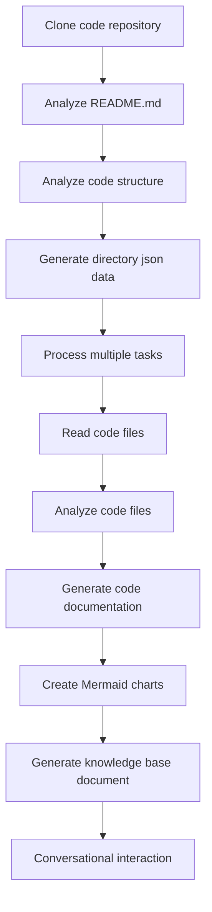

# OpenDeepWiki

[中文](README.zh-CN.md) | [English](README.md)

<div align="center">
  
  <h3>AI-Driven Code Knowledge Base</h3>
</div>

# Project Introduction

OpenDeepWiki is an open-source project inspired by [DeepWiki](https://deepwiki.com/), developed using .NET 9 and Semantic Kernel. It aims to help developers better understand and utilize codebases by providing features such as code analysis, documentation generation, and knowledge graph creation.
- Analyze code structure
- Understand core concepts of repositories
- Generate code documentation
- Automatically create README.md for code
  MCP Support


OpenDeepWiki supports MCP (Model Context Protocol)
- Supports providing an MCPServer for a single repository and conducting analysis on a single repository.

Usage: The following is the usage of cursor: 
```json
{
  "mcpServers": {
    "OpenDeepWiki":{
      "url": "http://Your OpenDeepWiki service IP:port/sse?owner=AIDotNet&name=OpenDeepWiki"
    }
  }
}
```
- owner: It is the name of the organization or owner of the repository.
- name: It is the name of the repository. 

After adding the repository, test by asking a question (please note that before doing this, the repository must be processed first): What is OpenDeepWiki? The effect is as shown in the picture: ! [](img/mcp.png)


In this way, you can use OpenDeepWiki as an MCPServer, making it available for other AI models to call upon, facilitating the analysis and understanding of an open-source project.

## Features

- **Quick Generation:** Convert all code repositories from Github, Gitlab, Gitee, Gitea, etc., into a knowledge base in just a few minutes.
- **Multi-language Support:** Supports code analysis and documentation generation for all programming languages.
- **Code Structure:** Automatically generate Mermaid charts to understand code structure.
- **Custom Models:** Supports custom models and custom APIs for extension as needed.
- **AI Intelligent Analysis:** AI-based code analysis and understanding of code relationships.
- **Easy SEO:** Generate SEO-friendly documents and knowledge bases using Next.js for better search engine indexing.
- **Conversational Interaction:** Support for conversational interaction with AI to obtain detailed information and usage methods for code, enabling deeper understanding.

## 🚀 Quick Start

1. Clone the repository
```bash
git clone https://github.com/AIDotNet/OpenDeepWiki.git
cd OpenDeepWiki
```

2. Open the `docker-compose.yml` file and modify the following environment variables:
```yaml
services:
  koalawiki:
    environment:
      - KOALAWIKI_REPOSITORIES=/repositories
      - TASK_MAX_SIZE_PER_USER=5 # Maximum parallel tasks for AI document generation per user
      - REPAIR_MERMAID=1 # Whether to repair Mermaid, 1 for repair, others for no repair
      - CHAT_MODEL=DeepSeek-V3 # Model must support functions
      - ANALYSIS_MODEL= # Analysis model for generating repository directory structure
      - CHAT_API_KEY= # Your API key
      - LANGUAGE= # Default language for generation set to "Chinese"
      - ENDPOINT=https://api.token-ai.cn/v1
      - DB_TYPE=sqlite
      - DB_CONNECTION_STRING=Data Source=/data/KoalaWiki.db
```

> 💡 **How to get an API Key:**
> - Get Google API key [Google AI Studio](https://makersuite.google.com/app/apikey)
> - Get OpenAI API key [OpenAI Platform](https://platform.openai.com/api-keys)
> - Get CoresHub [CoresHub](https://console.coreshub.cn/xb3/maas/global-keys) [Click here for 50 million free tokens](https://account.coreshub.cn/signup?invite=ZmpMQlZxYVU=)
> - Get TokenAI [TokenAI](https://api.token-ai.cn/)

3. Start the service

You can use the provided Makefile commands to easily manage the application:

```bash
# Build all Docker images
make build

# Start all services in background mode
make up

# Or start in development mode (with logs visible)
make dev
```

Then visit http://localhost:80 to access the knowledge base.

For more commands:
```bash
make help
```

### For Windows Users (without make)

If you're using Windows and don't have `make` available, you can use these Docker Compose commands directly:

```bash
# Build all Docker images
docker-compose build

# Start all services in background mode
docker-compose up -d

# Start in development mode (with logs visible)
docker-compose up

# Stop all services
docker-compose down

# View logs
docker-compose logs -f
```

For building specific architectures or services, use:

```bash
# Build only backend
docker-compose build koalawiki

# Build only frontend
docker-compose build koalawiki-web

# Build with architecture parameters
docker-compose build --build-arg ARCH=arm64
docker-compose build --build-arg ARCH=amd64
```

## 🔍 How It Works

OpenDeepWiki uses AI to:
 - Clone code repository locally
 - Analyze based on repository README.md
 - Analyze code structure and read code files as needed, then generate directory json data
 - Process tasks according to directory, each task is a document
 - Read code files, analyze code files, generate code documentation, and create Mermaid charts representing code structure dependencies
 - Generate the final knowledge base document
 - Analyze repository through conversational interaction and respond to user inquiries


## Advanced Configuration

### Environment Variables
  - KOALAWIKI_REPOSITORIES # Path for storing repositories
  - TASK_MAX_SIZE_PER_USER # Maximum parallel tasks for AI document generation per user
  - REPAIR_MERMAID # Whether to repair Mermaid, 1 for repair, others for no repair
  - CHAT_MODEL # Model must support functions
  - ENDPOINT # API Endpoint
  - ANALYSIS_MODEL # Analysis model for generating repository directory structure
  - CHAT_API_KEY # Your API key
  - LANGUAGE # Change the language of the generated documents
  - DB_TYPE # Database type, default is sqlite
  - DB_CONNECTION_STRING # Database connection string

### Build for Different Architectures
The Makefile provides commands to build for different CPU architectures:

```bash
# Build for ARM architecture
make build-arm

# Build for AMD architecture
make build-amd

# Build only backend for ARM
make build-backend-arm

# Build only frontend for AMD
make build-frontend-amd
```

## WeChat 


## 📄 License
This project is licensed under the MIT License - see the [LICENSE](./LICENSE) file for details.

## Star History

[](https://www.star-history.com/#AIDotNet/OpenDeepWiki&Date)
