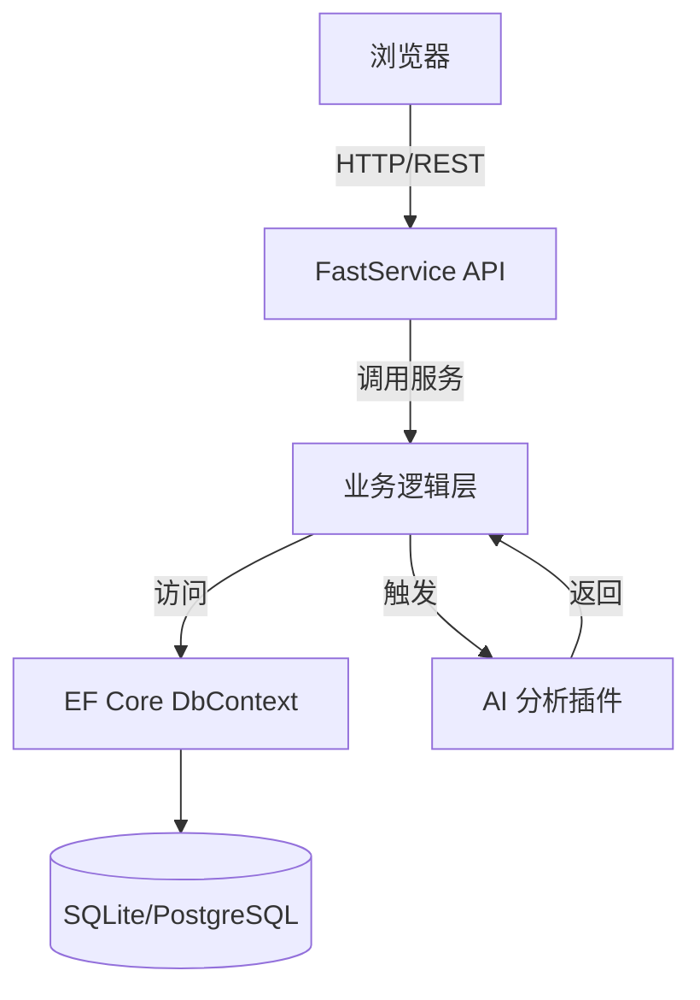

# OpenDeepWiki

<div align="center">
  
  <h3>AI驱动的代码知识库</h3>
</div>


# 项目介绍

OpenDeepWiki 是一个基于 AI 驱动的代码知识库平台，旨在自动分析代码仓库并生成详细可视化文档，帮助团队成员快速理解项目结构与实现原理。  
- 目标：  
  - 为新成员提供快速上手文档  
  - 为维护者梳理项目逻辑  
  - 为开发团队提供智能化代码洞见  
- 核心受众：  
  - 后端/前端开发者  
  - 项目架构师  
  - 技术文档编写者  

# 技术架构

## 组件拆解

- 前端（Next.js + React + Ant Design + TypeScript）  
- 后端（.NET 9 + FastService API + Semantic Kernel + EF Core + SQLite/PostgreSQL）  
- 数据存储（SQLite 或 PostgreSQL，可动态切换）  
- AI 服务层（基于 OpenAI 等模型的代码分析插件）

## 设计模式

- 依赖注入（ASP.NET Core DI）  
- 仓储模式（通过 `WarehouseStore` 管理分析任务）  
- 托管服务（`WarehouseTask` 用于后台任务调度）  
- 插件化架构（CodeAnalysis 插件目录）  

## 系统关系与数据流



# 实现细节

## 1. 主入口程序

`Program.cs` 配置了日志、DI、数据库上下文及 OpenAPI 接口。

```csharp
var builder = WebApplication.CreateBuilder(args);
Log.Logger = new LoggerConfiguration().WriteTo.Console().CreateLogger();
builder.Services.AddSerilog(Log.Logger);
builder.Services.AddOpenApi().WithFast();
builder.Services.AddSingleton<WarehouseStore>();
builder.Services.AddHostedService<WarehouseTask>();
// 根据配置选择 Sqlite 或 PostgreSQL
if (builder.Configuration.GetConnectionString("type")?.Equals("postgres", StringComparison.OrdinalIgnoreCase) == true)
    builder.Services.AddPostgreSQLDbContext(...);
else
    builder.Services.AddSqliteDbContext(...);
var app = builder.Build();
await dbContext.RunMigrateAsync();
app.UseCors("AllowAll");
app.MapFast();
app.Run();
```

Sources:  
- [Program.cs](https://github.com/AIDotNet/OpenDeepWiki/blob/master/src/OpenDeepWiki/Program.cs#L1-L40)
