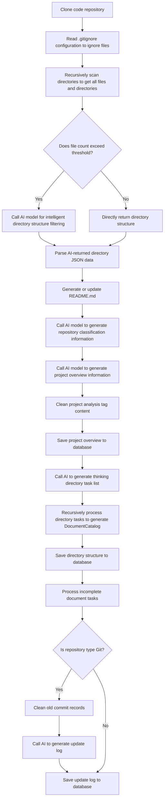

# OpenDeepWiki

[中文](README.zh-CN.md) | [English](README.md)

<div align="center">
  
  <h3>AI-Driven Code Knowledge Base</h3>
</div>

---

# Sponsor

[](https://share.302.ai/jXcaTv)

[302.AI](https://share.302.ai/jXcaTv) is a pay-as-you-go enterprise-level AI application platform that provides an open platform and open-source ecosystem to help AI solve various needs. Click [here](https://share.302.ai/jXcaTv) to get $1 free credit!

---

# Features

- **Quick Conversion**: Supports converting all GitHub, GitLab, Gitee, Gitea and other code repositories into knowledge bases within minutes.
- **Multi-language Support**: Supports code analysis and documentation generation for all programming languages.
- **Code Structure Diagrams**: Automatically generates Mermaid diagrams to help understand code structure.
- **Custom Model Support**: Supports custom models and custom APIs for flexible extension.
- **AI Intelligent Analysis**: AI-based code analysis and code relationship understanding.
- **SEO Friendly**: Generates SEO-friendly documentation and knowledge bases based on Next.js for easy search engine crawling.
- **Conversational Interaction**: Supports conversations with AI to obtain detailed code information and usage methods for deep code understanding.

---

# Feature List

- [x] Support multiple code repositories (GitHub, GitLab, Gitee, Gitea, etc.)
- [x] Support multiple programming languages (Python, Java, C#, JavaScript, etc.)
- [x] Support repository management (CRUD operations on repositories)
- [x] Support multiple AI providers (OpenAI, AzureOpenAI, Anthropic, etc.)
- [x] Support multiple databases (SQLite, PostgreSQL, SqlServer, etc.)
- [x] Support multiple languages (Chinese, English, French, etc.)
- [x] Support uploading ZIP files and local files
- [x] Provide data fine-tuning platform to generate fine-tuning datasets
- [x] Support directory-level repository management with dynamic directory and document generation
- [x] Support repository directory modification management
- [x] Support user management (CRUD operations on users)
- [x] Support user permission management
- [x] Support repository-level generation of different fine-tuning framework datasets

---

# Project Introduction

OpenDeepWiki is an open-source project inspired by [DeepWiki](https://deepwiki.com/), developed based on .NET 9 and Semantic Kernel. It aims to help developers better understand and utilize code repositories, providing features such as code analysis, documentation generation, and knowledge graph construction.

Main Features:

- Analyze code structure
- Understand repository core concepts
- Generate code documentation
- Automatically generate README.md for code
- Support MCP (Model Context Protocol)

---

# MCP Support

OpenDeepWiki supports the MCP protocol:

- Can serve as a single repository MCPServer for repository analysis.

Example configuration:

```json
{
  "mcpServers": {
    "OpenDeepWiki":{
      "url": "http://Your OpenDeepWiki service IP:port/sse?owner=AIDotNet&name=OpenDeepWiki"
    }
  }
}
```

- owner: Repository organization or owner name
- name: Repository name

After adding the repository, you can test by asking questions like "What is OpenDeepWiki?", with effects as shown below:


This way, OpenDeepWiki can serve as an MCPServer for other AI models to call, facilitating analysis and understanding of open-source projects.

---

# 🚀 Quick Start

1. Clone the repository

```bash
git clone https://github.com/AIDotNet/OpenDeepWiki.git
cd OpenDeepWiki
```

2. Modify environment variable configuration in `docker-compose.yml`:

- OpenAI example:

```yaml
services:
  koalawiki:
    environment:
      - KOALAWIKI_REPOSITORIES=/repositories
      - TASK_MAX_SIZE_PER_USER=5 # Maximum parallel document generation tasks per user for AI
      - CHAT_MODEL=DeepSeek-V3 # Model must support function calling
      - ANALYSIS_MODEL= # Analysis model for generating repository directory structure
      - CHAT_API_KEY= # Your API Key
      - LANGUAGE= # Default generation language, e.g., "Chinese"
      - ENDPOINT=https://api.token-ai.cn/v1
      - DB_TYPE=sqlite
      - MODEL_PROVIDER=OpenAI # Model provider, supports OpenAI, AzureOpenAI, Anthropic
      - DB_CONNECTION_STRING=Data Source=/data/KoalaWiki.db
      - EnableSmartFilter=true # Whether to enable smart filtering, affects AI's ability to get repository file directories
      - UPDATE_INTERVAL # Repository incremental update interval in days
      - MAX_FILE_LIMIT=100 # Maximum upload file limit in MB
      - DEEP_RESEARCH_MODEL= # Deep research model, if empty uses CHAT_MODEL
      - ENABLE_INCREMENTAL_UPDATE=true # Whether to enable incremental updates
      - ENABLE_CODED_DEPENDENCY_ANALYSIS=false # Whether to enable code dependency analysis, may affect code quality
```

- AzureOpenAI and Anthropic configurations are similar, only need to adjust `ENDPOINT` and `MODEL_PROVIDER`.

3. Start services

Using Makefile commands:

```bash
# Build all Docker images
make build

# Start all services in background
make up

# Start in development mode (with visible logs)
make dev
```

Visit http://localhost:8090 to access the knowledge base page.

For Windows users without make environment, use Docker Compose directly:

```bash
docker-compose build
docker-compose up -d
docker-compose up
docker-compose down
docker-compose logs -f
```

---

# Deployment Recommendations

- Build for specific architecture:

```bash
docker-compose build --build-arg ARCH=arm64
docker-compose build --build-arg ARCH=amd64
```

- Build only backend or frontend:

```bash
docker-compose build koalawiki
docker-compose build koalawiki-web
```

- One-click deployment to Sealos (supports public network access):

[](https://bja.sealos.run/?openapp=system-template%3FtemplateName%3DOpenDeepWiki)

For detailed steps, please refer to: [One-click Sealos Deployment of OpenDeepWiki](scripts/sealos/README.zh-CN.md)

---

# 🔍 How It Works

OpenDeepWiki leverages AI to achieve:

- Clone code repository locally
- Read .gitignore configuration to ignore irrelevant files
- Recursively scan directories to get all files and directories
- Determine if file count exceeds threshold; if so, call AI model for intelligent directory filtering
- Parse AI-returned directory JSON data
- Generate or update README.md
- Call AI model to generate repository classification information and project overview
- Clean project analysis tag content and save project overview to database
- Call AI to generate thinking directory (task list)
- Recursively process directory tasks to generate document directory structure
- Save directory structure to database
- Process incomplete document tasks
- If Git repository, clean old commit records, call AI to generate update log and save

---

# OpenDeepWiki Repository Parsing to Documentation Detailed Flow Chart



---

# Advanced Configuration

## Environment Variables

- `KOALAWIKI_REPOSITORIES`: Repository storage path
- `TASK_MAX_SIZE_PER_USER`: Maximum parallel document generation tasks per user for AI
- `CHAT_MODEL`: Chat model (must support function calling)
- `ENDPOINT`: API endpoint
- `ANALYSIS_MODEL`: Analysis model for generating repository directory structure
- `CHAT_API_KEY`: API key
- `LANGUAGE`: Document generation language
- `DB_TYPE`: Database type, default sqlite
- `MODEL_PROVIDER`: Model provider, default OpenAI, supports AzureOpenAI, Anthropic
- `DB_CONNECTION_STRING`: Database connection string
- `EnableSmartFilter`: Whether to enable smart filtering, affects AI's ability to get repository directories
- `UPDATE_INTERVAL`: Repository incremental update interval (days)
- `MAX_FILE_LIMIT`: Maximum upload file limit (MB)
- `DEEP_RESEARCH_MODEL`: Deep research model, if empty uses CHAT_MODEL
- `ENABLE_INCREMENTAL_UPDATE`: Whether to enable incremental updates
- `ENABLE_CODED_DEPENDENCY_ANALYSIS`: Whether to enable code dependency analysis, may affect code quality

## Build for Different Architectures

Makefile commands:

```bash
make build-arm    # ARM architecture
make build-amd    # AMD architecture
make build-backend-arm   # Backend only ARM
make build-frontend-amd  # Frontend only AMD
```

---

# Community

- Discord: [join us](https://discord.gg/8sxUNacv)
- WeChat Official Account QR Code:


---

# 📄 License

This project is licensed under the MIT License. See [LICENSE](./LICENSE) for details.

---

# ⭐ Star History

[](https://www.star-history.com/#AIDotNet/OpenDeepWiki&Date)
