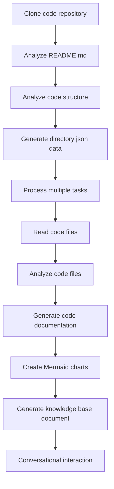

# OpenDeepWiki

[中文](README.zh-CN.md) | [English](README.md)

<div align="center">
  
  <h3>AI-Driven Code Knowledge Base</h3>
</div>

# Project Introduction

OpenDeepWiki is an open-source project inspired by [DeepWiki](https://deepwiki.com/), developed using .NET 9 and Semantic Kernel. It aims to help developers better understand and utilize codebases by providing features such as code analysis, documentation generation, and knowledge graph creation.
- Analyze code structure
- Understand core concepts of repositories
- Generate code documentation
- Automatically create README.md for code

## Features

- **Quick Generation:** Convert all code repositories from Github, Gitlab, Gitee, Gitea, etc., into a knowledge base in just a few minutes.
- **Multi-language Support:** Supports code analysis and documentation generation for all programming languages.
- **Code Structure:** Automatically generate Mermaid charts to understand code structure.
- **Custom Models:** Supports custom models and custom APIs for extension as needed.
- **AI Intelligent Analysis:** AI-based code analysis and understanding of code relationships.
- **Easy SEO:** Generate SEO-friendly documents and knowledge bases using Next.js for better search engine indexing.
- **Conversational Interaction:** Support for conversational interaction with AI to obtain detailed information and usage methods for code, enabling deeper understanding.

## 🚀 Quick Start

1. Clone the repository
```bash
git clone https://github.com/AIDotNet/OpenDeepWiki.git
cd OpenDeepWiki
```

Open the `docker-compose.yml` file and modify the following environment variables:
```yaml
version: '3.8'
services:
  koalawiki:
    image: crpi-j9ha7sxwhatgtvj4.cn-shenzhen.personal.cr.aliyuncs.com/koala-ai/koala-wiki
    environment:
      - KOALAWIKI_REPOSITORIES=/repositories
      - TaskMaxSizePerUser=5 # The maximum number of documents generated by AI processing for each user
      - REPAIR_MERMAID=1 # Whether to carry out Mermaid repair, 1 repair, no repair for the rest
      - ChatModel=DeepSeek-V3 # It is necessary to support the model of function
      - AnalysisModel= # The analysis model is used to generate the warehouse directory structure, which is very important. The stronger the model, the better the generated directory structure. If it is empty, use the ChatModel
      - ChatApiKey=Your APIkey
      - LANGUAGE= # Set the generation language to default to "Chinese"
      - Endpoint=https://api.token-ai.cn/v1
    volumes:
      - ./repositories:/app/repositories
      - ./data:/data
    build:
      context: .
      dockerfile: src/KoalaWiki/Dockerfile
      
  koalawiki-web:
    image: crpi-j9ha7sxwhatgtvj4.cn-shenzhen.personal.cr.aliyuncs.com/koala-ai/koala-wiki-web
    environment:
      - NEXT_PUBLIC_API_URL=http://koalawiki:8080 # 用于提供给server的地址
    build:
      context: ./web
      dockerfile: Dockerfile
      
  nginx: # 需要nginx将前端和后端代理到一个端口
    image: nginx:alpine
    ports:
      - 8090:80
    volumes:
      - ./nginx/nginx.conf:/etc/nginx/conf.d/default.conf
    depends_on:
      - koalawiki
      - koalawiki-web
```

> 💡 **How to get an API Key:**
> - Get Google API key [Google AI Studio](https://makersuite.google.com/app/apikey)
> - Get OpenAI API key [OpenAI Platform](https://platform.openai.com/api-keys)
> - Get CoresHub [CoresHub](https://console.coreshub.cn/xb3/maas/global-keys) [Click here for 50 million free tokens](https://account.coreshub.cn/signup?invite=ZmpMQlZxYVU=)
> - Get TokenAI [TokenAI](https://api.token-ai.cn/)

2. Start the service

```bash
docker-compose up -d
```
Then visit http://localhost:8090 to access the knowledge base

## 🔍 How It Works

OpenDeepWiki uses AI to:
 - Clone code repository locally
 - Analyze based on repository README.md
 - Analyze code structure and read code files as needed, then generate directory json data
 - Process tasks according to directory, each task is a document
 - Read code files, analyze code files, generate code documentation, and create Mermaid charts representing code structure dependencies
 - Generate the final knowledge base document
 - Analyze repository through conversational interaction and respond to user inquiries


## Advanced Configuration

### Environment Variables
  - KOALAWIKI_REPOSITORIES # Path for storing repositories
  - TaskMaxSizePerUser # Maximum parallel tasks for AI document generation per user
  - REPAIR_MERMAID # Whether to repair Mermaid, 1 for repair, others for no repair
  - ChatModel # Model must support functions
  - Endpoint # API Endpoint
  - AnalysisModel # Analysis model for generating repository directory structure, very important, stronger models yield better directory structures, empty uses ChatModel
  - ChatApiKey # Your API key
  - LANGUAGE # Change the language of the generated documents

## WeChat 


## 📄 License
This project is licensed under the MIT License - see the [LICENSE](./LICENSE) file for details.

## Star History

[](https://www.star-history.com/#AIDotNet/OpenDeepWiki&Date)
