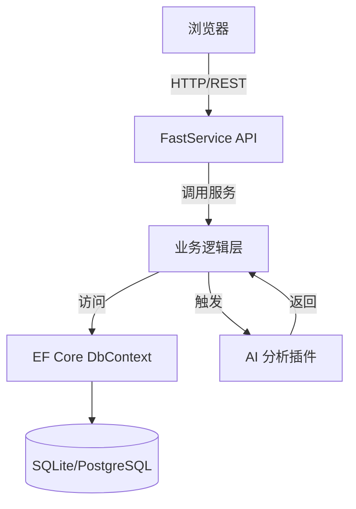
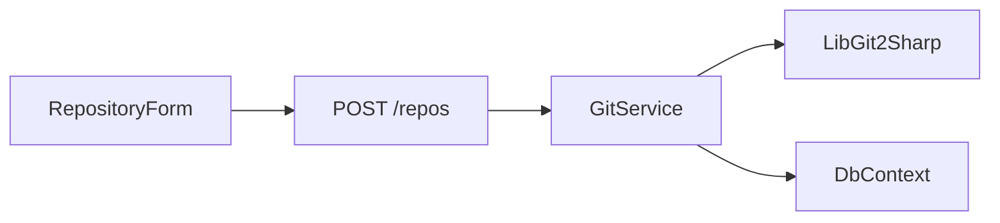
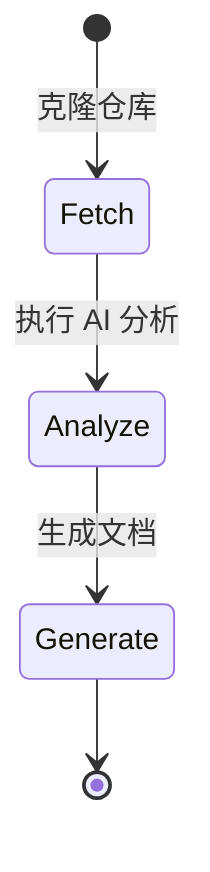
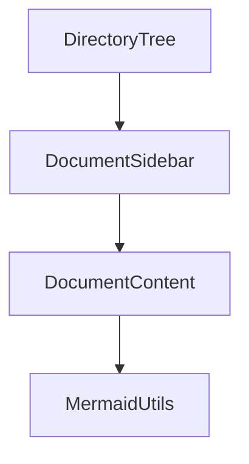

# KoalaWiki

<div align="center">
  
  <h3>AI驱动的代码知识库</h3>
</div>


# 项目介绍

KoalaWiki 是一个基于 AI 驱动的代码知识库平台，旨在自动分析代码仓库并生成详细可视化文档，帮助团队成员快速理解项目结构与实现原理。  
- 目标：  
  - 为新成员提供快速上手文档  
  - 为维护者梳理项目逻辑  
  - 为开发团队提供智能化代码洞见  
- 核心受众：  
  - 后端/前端开发者  
  - 项目架构师  
  - 技术文档编写者  

# 技术架构

## 组件拆解

- 前端（Next.js + React + Ant Design + TypeScript）  
- 后端（.NET 9 + FastService API + Semantic Kernel + EF Core + SQLite/PostgreSQL）  
- 数据存储（SQLite 或 PostgreSQL，可动态切换）  
- AI 服务层（基于 OpenAI 等模型的代码分析插件）

## 设计模式

- 依赖注入（ASP.NET Core DI）  
- 仓储模式（通过 `WarehouseStore` 管理分析任务）  
- 托管服务（`WarehouseTask` 用于后台任务调度）  
- 插件化架构（CodeAnalysis 插件目录）  

## 系统关系与数据流



# 实现细节

## 1. 主入口程序

`Program.cs` 配置了日志、DI、数据库上下文及 OpenAPI 接口。

```csharp
var builder = WebApplication.CreateBuilder(args);
Log.Logger = new LoggerConfiguration().WriteTo.Console().CreateLogger();
builder.Services.AddSerilog(Log.Logger);
builder.Services.AddOpenApi().WithFast();
builder.Services.AddSingleton<WarehouseStore>();
builder.Services.AddHostedService<WarehouseTask>();
// 根据配置选择 Sqlite 或 PostgreSQL
if (builder.Configuration.GetConnectionString("type")?.Equals("postgres", StringComparison.OrdinalIgnoreCase) == true)
    builder.Services.AddPostgreSQLDbContext(...);
else
    builder.Services.AddSqliteDbContext(...);
var app = builder.Build();
await dbContext.RunMigrateAsync();
app.UseCors("AllowAll");
app.MapFast();
app.Run();
```

Sources:  
- [Program.cs](https://github.com/239573049/KoalaWiki/blob/master/src/KoalaWiki/Program.cs#L1-L40)

## 2. 数据访问扩展

`ServiceExtensions.cs` 通过泛型方法统一注册 EF Core 上下文：

```csharp
public static IServiceCollection AddDataAccess<TContext>(...)
    where TContext : KoalaWikiContext<TContext>
{
    services.AddDbContext<IKoalaWikiContext, TContext>(configureContext);
    return services;
}
```

Sources:  
- [ServiceExtensions.cs](https://github.com/239573049/KoalaWiki/blob/master/KoalaWiki.Core/ServiceExtensions.cs#L1-L20)

## 3. 配置管理

- `appsettings.json`：数据库类型、连接字符串、日志级别等  
- `appsettings.Development.json`：开发环境覆盖  
- Docker 支持：`Dockerfile` & `docker-compose.yml`  

```json
{
  "ConnectionStrings": {
    "Type": "sqlite",
    "Default": "Data Source=/data/KoalaWiki.db"
  }
}
```

Sources:  
- [appsettings.json](https://github.com/239573049/KoalaWiki/blob/master/src/KoalaWiki/appsettings.json#L1-L15)

## 4. 外部依赖

- .NET 9.0, EF Core, LibGit2Sharp  
- Next.js 15, React 19, Ant Design 5  
- OpenAI SDK (通过 `KoalaHttpClientHander` 与 AI 模型对接)  

# 关键功能

## 仓库管理

- 添加多仓库，维护分支与凭据  
- UI 表单组件：`RepositoryForm.tsx`、`RepositoryList.tsx`  
- 服务层：`GitService` 提供仓库信息抓取  



## AI 代码分析

- 插件目录：`src/KoalaWiki/plugins/CodeAnalysis`  
- 核心流程：拉取代码 → 分析 AST/依赖 → 生成 Markdown/图表  



## 自动文档生成

- 基于 Mapster 映射 DTO  
- 生成 `PageDto`、`WarehouseInput` 等输出  

## 知识库导航

- 前端目录树组件：`DirectoryTree.tsx`  
- 根据分析结果动态渲染侧边栏及文档页面  



# 总结与建议

KoalaWiki 通过 .NET 与前端现代栈深度结合，实现了端到端的代码仓库智能分析与展示。  
- 强项：插件化、灵活的数据库支持、丰富的可视化组件  
- 改进：  
  - 增加单元测试覆盖  
  - 提升大仓库分析性能（分块/流式处理）  
  - 支持更多语言（目前主要聚焦 C#）


<div align="center">
  <sub>由 ❤️ AIDotNet 团队开发</sub>
</div>
