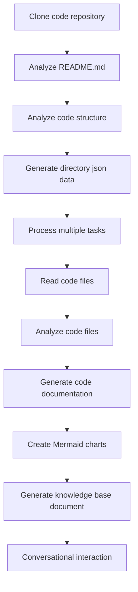

# OpenDeepWiki

[中文](README.zh-CN.md) | [English](README.md)

<div align="center">
  
  <h3>AI-Driven Code Knowledge Base</h3>
</div>

# Sponsor

[](https://share.302.ai/jXcaTv)

[302.AI](https://share.302.ai/jXcaTv)is a pay-as-you-go, one-stop enterprise-level AI application platform. It offers an open platform and open-source ecosystem, allowing AI to find solutions for every need. Click [here](https://share.302.ai/jXcaTv) to get your $1 free credit!

## Function

- **Quick Conversion:** All Github, Gitlab, Gitee, Gitea and other code repositories can be converted into knowledge bases in just a few minutes.
- **Multi-language Support:** Code analysis and documentation generation are supported for all programming languages.
- **Code Structure:** Automatic Mermaid diagrams are generated to understand the code structure.
- **Custom Models:** Custom models and custom APIs are supported, allowing for expansion as needed.
- **AI Intelligent Analysis:** Code analysis and understanding of code relationships based on AI.
- **Easy SEO:** Generate SEO-friendly documents and knowledge bases using Next.js, making it easier for search engines to index.
- **Dialogic Interaction:** Supports dialogic interaction with AI to obtain detailed information and usage methods of the code, and to deeply understand the code.

Feature list:
- [x] Supports multiple code repositories (Github, Gitlab, Gitee, Gitea, etc.)
- [x] Supports multiple programming languages (Python, Java, C#, JavaScript, etc.)
- [x] Supports repository management, providing functions for adding, deleting, modifying, and querying repositories
- [x] Supports multiple AI providers (OpenAI, AzureOpenAI, Anthropic, etc.)
- [x] Supports multiple databases (SQLite, PostgreSQL, SqlServer, etc.)
- [x] Supports multiple languages (Chinese, English, French, etc.)
- [x] Supports uploading ZIP files, and uploading local files
- [x] provides a data fine-tuning platform to generate fine-tuning datasets
- [x] Supports directory-level management of repositories, allowing for custom directory generation and dynamic documentation creation
- [x] Supports repository directory management, allowing for modification of repository directories
- [x] Supports user-level management, providing user management functions for adding, deleting, modifying, and querying users
- [ ] Supports user permission management, providing user permission management functions for adding, deleting, modifying, and querying user permissions
- [x] Supports generating different fine-tuning framework datasets at the repository level

# Project Introduction

OpenDeepWiki is an open-source project inspired by [DeepWiki](https://deepwiki.com/), developed using .NET 9 and Semantic Kernel. It aims to help developers better understand and utilize codebases by providing features such as code analysis, documentation generation, and knowledge graph creation.
- Analyze code structure
- Understand core concepts of repositories
- Generate code documentation
- Automatically create README.md for code
  MCP Support


OpenDeepWiki supports MCP (Model Context Protocol)
- Supports providing an MCPServer for a single repository and conducting analysis on a single repository.

Usage: The following is the usage of cursor: 
```json
{
  "mcpServers": {
    "OpenDeepWiki":{
      "url": "http://Your OpenDeepWiki service IP:port/sse?owner=AIDotNet&name=OpenDeepWiki"
    }
  }
}
```
- owner: It is the name of the organization or owner of the repository.
- name: It is the name of the repository. 

After adding the repository, test by asking a question (please note that before doing this, the repository must be processed first): What is OpenDeepWiki? The effect is as shown in the picture: ! [](img/mcp.png)


In this way, you can use OpenDeepWiki as an MCPServer, making it available for other AI models to call upon, facilitating the analysis and understanding of an open-source project.

## 🚀 Quick Start

1. Clone the repository
```bash
git clone https://github.com/AIDotNet/OpenDeepWiki.git
cd OpenDeepWiki
```

2. Open the `docker-compose.yml` file and modify the following environment variables:

Ollama:
```yaml
services:
  koalawiki:
    environment:
      - KOALAWIKI_REPOSITORIES=/repositories
      - TASK_MAX_SIZE_PER_USER=5 # Maximum number of parallel document generation tasks per user by AI
      - CHAT_MODEL=qwen2.5:32b # Model must support functions
      - ANALYSIS_MODEL=qwen2.5:32b # Analysis model used for generating repository directory structure
      - CHAT_API_KEY=sk-xxxxx # Your API key
      - LANGUAGE= # Set the default language for generation as "Chinese"
      - ENDPOINT=https://Your Ollama's IP: Port/v1
      - DB_TYPE=sqlite
      - MODEL_PROVIDER=OpenAI # Model provider, default is OpenAI, supports AzureOpenAI and Anthropic
      - DB_CONNECTION_STRING=Data Source=/data/KoalaWiki.db
      - EnableSmartFilter=true # Whether intelligent filtering is enabled or not may affect how the AI can obtain the file directory of the repository
      - UPDATE_INTERVAL # Warehouse increment update interval, unit: days
      - MAX_FILE_LIMIT=100 # The maximum limit for uploading files, in MB
      - DEEP_RESEARCH_MODEL= # Conduct in-depth research on the model and use CHAT_MODEL for the empty
      - ENABLE_INCREMENTAL_UPDATE=true # Whether to enable incremental updates 
      - ENABLE_CODED_DEPENDENCY_ANALYSIS=false # Whether to enable code dependency analysis,This might have an impact on the quality of the code.
      - ENABLE_WAREHOUSE_FUNCTION_PROMPT_TASK=false # Whether to enable MCP Prompt generation or not.
      - ENABLE_WAREHOUSE_DESCRIPTION_TASK=false # Whether to enable the generation of warehouse Description
```


OpenAI:
```yaml
services:
  koalawiki:
    environment:
      - KOALAWIKI_REPOSITORIES=/repositories
      - TASK_MAX_SIZE_PER_USER=5 # Maximum number of parallel document generation tasks per user by AI
      - CHAT_MODEL=DeepSeek-V3 # Model must support functions
      - ANALYSIS_MODEL= # Analysis model used for generating repository directory structure
      - CHAT_API_KEY= # Your API key
      - LANGUAGE= # Set the default language for generation as "Chinese"
      - ENDPOINT=https://api.token-ai.cn/v1
      - DB_TYPE=sqlite
      - MODEL_PROVIDER=OpenAI # Model provider, default is OpenAI, supports AzureOpenAI and Anthropic
      - DB_CONNECTION_STRING=Data Source=/data/KoalaWiki.db
      - EnableSmartFilter=true # Whether intelligent filtering is enabled or not may affect how the AI can obtain the file directory of the repository
      - UPDATE_INTERVAL # Warehouse increment update interval, unit: days
      - MAX_FILE_LIMIT=100 # The maximum limit for uploading files, in MB
      - DEEP_RESEARCH_MODEL= # Conduct in-depth research on the model and use CHAT_MODEL for the empty
      - ENABLE_INCREMENTAL_UPDATE=true # Whether to enable incremental updates 
      - ENABLE_CODED_DEPENDENCY_ANALYSIS=false # Whether to enable code dependency analysis,This might have an impact on the quality of the code.
      - ENABLE_WAREHOUSE_FUNCTION_PROMPT_TASK=false # Whether to enable MCP Prompt generation or not.
      - ENABLE_WAREHOUSE_DESCRIPTION_TASK=false # Whether to enable the generation of warehouse Description
```

AzureOpenAI:
```yaml
services:
  koalawiki:
    environment:
      - KOALAWIKI_REPOSITORIES=/repositories
      - TASK_MAX_SIZE_PER_USER=5 # Maximum number of parallel document generation tasks per user by AI
      - CHAT_MODEL=DeepSeek-V3 # Model must support functions
      - ANALYSIS_MODEL= # Analysis model used for generating repository directory structure
      - CHAT_API_KEY= # Your API key
      - LANGUAGE= # Set the default language for generation as "Chinese"
      - ENDPOINT=https://your-azure-address.openai.azure.com/
      - DB_TYPE=sqlite
      - MODEL_PROVIDER=AzureOpenAI # Model provider, default is OpenAI, supports AzureOpenAI and Anthropic
      - DB_CONNECTION_STRING=Data Source=/data/KoalaWiki.db
      - EnableSmartFilter=true # Whether intelligent filtering is enabled or not may affect how the AI can obtain the file directory of the repository
      - UPDATE_INTERVAL # Warehouse increment update interval, unit: days
      - MAX_FILE_LIMIT=100 # The maximum limit for uploading files, in MB
      - DEEP_RESEARCH_MODEL= # Conduct in-depth research on the model and use CHAT_MODEL for the empty
      - ENABLE_INCREMENTAL_UPDATE=true # Whether to enable incremental updates
      - ENABLE_CODED_DEPENDENCY_ANALYSIS=false # Whether to enable code dependency analysis,This might have an impact on the quality of the code.
      - ENABLE_WAREHOUSE_FUNCTION_PROMPT_TASK=false # Whether to enable MCP Prompt generation or not.
      - ENABLE_WAREHOUSE_DESCRIPTION_TASK=false # Whether to enable the generation of warehouse Description
```

Anthropic:
```yaml
services:
  koalawiki:
    environment:
      - KOALAWIKI_REPOSITORIES=/repositories
      - TASK_MAX_SIZE_PER_USER=5 # Maximum number of parallel document generation tasks per user by AI
      - CHAT_MODEL=DeepSeek-V3 # Model must support functions
      - ANALYSIS_MODEL= # Analysis model used for generating repository directory structure
      - CHAT_API_KEY= # Your API key
      - LANGUAGE= # Set the default language for generation as "Chinese"
      - ENDPOINT=https://api.anthropic.com/
      - DB_TYPE=sqlite
      - MODEL_PROVIDER=Anthropic # Model provider, default is OpenAI, supports AzureOpenAI and Anthropic
      - DB_CONNECTION_STRING=Data Source=/data/KoalaWiki.db
      - EnableSmartFilter=true # Whether intelligent filtering is enabled or not may affect how the AI can obtain the file directory of the repository
      - UPDATE_INTERVAL # Warehouse increment update interval, unit: days
      - MAX_FILE_LIMIT=100 # The maximum limit for uploading files, in MB
      - DEEP_RESEARCH_MODEL= # Conduct in-depth research on the model and use CHAT_MODEL for the empty
      - ENABLE_INCREMENTAL_UPDATE=true # Whether to enable incremental updates
      - ENABLE_CODED_DEPENDENCY_ANALYSIS=false # Whether to enable code dependency analysis,This might have an impact on the quality of the code.
      - ENABLE_WAREHOUSE_FUNCTION_PROMPT_TASK=false # Whether to enable MCP Prompt generation or not.
      - ENABLE_WAREHOUSE_DESCRIPTION_TASK=false # Whether to enable the generation of warehouse Description
```

> 💡 **How to get an API Key:**
> - Get Google API key [Google AI Studio](https://makersuite.google.com/app/apikey)
> - Get OpenAI API key [OpenAI Platform](https://platform.openai.com/api-keys)
> - Get CoresHub [CoresHub](https://console.coreshub.cn/xb3/maas/global-keys) [Click here for 50 million free tokens](https://account.coreshub.cn/signup?invite=ZmpMQlZxYVU=)
> - Get TokenAI [TokenAI](https://api.token-ai.cn/)

3. Start the service

You can use the provided Makefile commands to easily manage the application:

```bash
# Build all Docker images
make build

# Start all services in background mode
make up

# Or start in development mode (with logs visible)
make dev
```

Then visit http://localhost:8090 to access the knowledge base.

For more commands:
```bash
make help
```

### For Windows Users (without make)

If you're using Windows and don't have `make` available, you can use these Docker Compose commands directly:

```bash
# Build all Docker images
docker-compose build

# Start all services in background mode
docker-compose up -d

# Start in development mode (with logs visible)
docker-compose up

# Stop all services
docker-compose down

# View logs
docker-compose logs -f
```

For building specific architectures or services, use:

```bash
# Build only backend
docker-compose build koalawiki

# Build only frontend
docker-compose build koalawiki-web

# Build with architecture parameters
docker-compose build --build-arg ARCH=arm64
docker-compose build --build-arg ARCH=amd64
```


### Deploy to Sealos with Public Internet Access
[](https://bja.sealos.run/?openapp=system-template%3FtemplateName%3DOpenDeepWiki)
For detailed steps, refer to:[One-Click Deployment of OpenDeepWiki as a Sealos Application Exposed to the Public Network Using Templates](scripts/sealos/README.zh-CN.md)

## 🔍 How It Works

OpenDeepWiki uses AI to:
 - Clone code repository locally
 - Analyze based on repository README.md
 - Analyze code structure and read code files as needed, then generate directory json data
 - Process tasks according to directory, each task is a document
 - Read code files, analyze code files, generate code documentation, and create Mermaid charts representing code structure dependencies
 - Generate the final knowledge base document
 - Analyze repository through conversational interaction and respond to user inquiries


## Advanced Configuration

### Environment Variables
  - KOALAWIKI_REPOSITORIES  Path for storing repositories
  - TASK_MAX_SIZE_PER_USER  Maximum parallel tasks for AI document generation per user
  - CHAT_MODEL  Model must support functions
  - ENDPOINT  API Endpoint
  - ANALYSIS_MODEL  Analysis model for generating repository directory structure
  - CHAT_API_KEY  Your API key
  - LANGUAGE  Change the language of the generated documents
  - DB_TYPE  Database type, default is sqlite
  - MODEL_PROVIDER  Model provider, by default OpenAI, supports Azure, OpenAI and Anthropic
  - DB_CONNECTION_STRING  Database connection string
  - EnableSmartFilter Whether intelligent filtering is enabled or not may affect how the AI can obtain the file directory of the repository
  - UPDATE_INTERVAL Warehouse increment update interval, unit: days
  - MAX_FILE_LIMIT The maximum limit for uploading files, in MB
  - DEEP_RESEARCH_MODEL Conduct in-depth research on the model and use CHAT_MODEL for the empty
  - ENABLE_INCREMENTAL_UPDATE Whether to enable incremental updates
  - ENABLE_CODED_DEPENDENCY_ANALYSIS Whether to enable code dependency analysis,This might have an impact on the quality of the code.
  - ENABLE_WAREHOUSE_FUNCTION_PROMPT_TASK  # Whether to enable MCP Prompt generation or not.
  - ENABLE_WAREHOUSE_DESCRIPTION_TASK # Whether to enable the generation of warehouse Description

### Build for Different Architectures
The Makefile provides commands to build for different CPU architectures:

```bash
# Build for ARM architecture
make build-arm

# Build for AMD architecture
make build-amd

# Build only backend for ARM
make build-backend-arm

# Build only frontend for AMD
make build-frontend-amd
```

## 👥 Contributors

Thanks to all the developers who contributed to this project!
<div align="center">
<a href="https://github.com/AIDotNet/OpenDeepWiki/graphs/contributors">
  
</a>

## Discord

[join us](https://discord.gg/Y3fvpnGVwt)

## WeChat 


## 📄 License
This project is licensed under the MIT License - see the [LICENSE](./LICENSE) file for details.

## Star History

[](https://www.star-history.com/#AIDotNet/OpenDeepWiki&Date)
