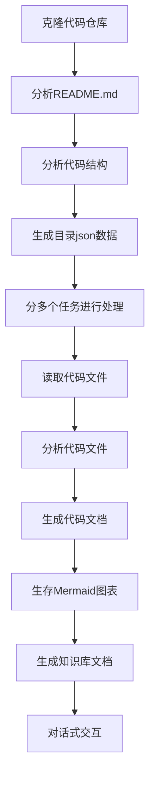

# OpenDeepWiki

[中文](README.zh-CN.md) | [English](README.md)

<div align="center">
  
  <h3>AI驱动的代码知识库</h3>
</div>


# 项目介绍

OpenDeepWiki 是参考[DeepWiki](https://deepwiki.com/) 作为灵感，基于 .NET 9 和 Semantic Kernel 开发的开源项目。它旨在帮助开发者更好地理解和使用代码库，提供代码分析、文档生成、知识图谱等功能。
- 分析代码结构
- 理解仓库核心概念
- 生成代码文档
- 自动生成代码README.md

## MCP支持

OpenDeepWiki支持MCP（ModelContextProtocol）
- 支持单仓库提供MCPServer，针对单个仓库进行分析

使用方式：下面是cursor的使用方式：
```json
{
  "mcpServers": {
    "OpenDeepWiki":{
       "url": "http://您的OpenDeepWiki服务IP:端口/sse?owner=AIDotNet&name=OpenDeepWiki"
    }
  }
}
```

- owner: 是仓库组织或拥有者的名称
- name: 是仓库的名称

添加好仓库以后进行测试提问（请注意，再次之前这个仓库需要先保证已经处理完成）：OpenDeepWiki是什么？
效果如图：

通过这种方式，您可以将OpenDeepWiki作为MCPServer使用，提供给其他的AI模型进行调用，方便对一个开源项目进行分析和理解。

## 功能


- **快速生成：** 只需要几分钟即可将所有的Github，Gitlab，Gitee，Gitea等代码仓库转换为知识库
- **多语言支持：** 支持所有编程语言的代码分析和文档生成
- **代码结构：** 自动生存Mermaid图表理解代码结构
- **自定义模型：** 支持自定义模型和自定义API，可以根据需要进行扩展
- **AI智能分析：** 基于AI的代码分析和代码关系的理解
- **轻松SEO:** 生成SEO友好的文档和知识库，使用Next.js构建，让搜索引擎更容易索引
- **对话式交互：** 支持与AI进行对话式交互，获取代码的详细信息和使用方法，深入理解代码

## 🚀 快速开始

1. 克隆代码库
```bash
git clone https://github.com/AIDotNet/OpenDeepWiki.git
cd OpenDeepWiki
```

2. 打开`docker-compose.yml`文件，修改以下环境变量：

OpenAI：
```yaml
services:
  koalawiki:
    environment:
      - KOALAWIKI_REPOSITORIES=/repositories
      - TASK_MAX_SIZE_PER_USER=5 # 每个用户AI处理文档生成的最大并行数量
      - CHAT_MODEL=DeepSeek-V3 # 必须要支持function的模型
      - ANALYSIS_MODEL= # 分析模型，用于生成仓库目录结构
      - CHAT_API_KEY= # 您的APIkey
      - LANGUAGE= # 设置生成语言默认为"中文"
      - ENDPOINT=https://api.token-ai.cn/v1
      - DB_TYPE=sqlite
      - MODEL_PROVIDER=OpenAI # 模型提供商，默认为OpenAI 支持AzureOpenAI和Anthropic
      - DB_CONNECTION_STRING=Data Source=/data/KoalaWiki.db
      - EnableSmartFilter=true # 是否启用智能过滤，这可能影响AI得到仓库的文件目录
```

AzureOpenAI
```yaml
services:
  koalawiki:
    environment:
      - KOALAWIKI_REPOSITORIES=/repositories
      - TASK_MAX_SIZE_PER_USER=5 # 每个用户AI处理文档生成的最大并行数量
      - CHAT_MODEL=DeepSeek-V3 # 必须要支持function的模型
      - ANALYSIS_MODEL= # 分析模型，用于生成仓库目录结构
      - CHAT_API_KEY= # 您的APIkey
      - LANGUAGE= # 设置生成语言默认为"中文"
      - ENDPOINT=https://您的Azure地址.openai.azure.com/
      - DB_TYPE=sqlite
      - MODEL_PROVIDER=AzureOpenAI # 模型提供商，默认为OpenAI 支持AzureOpenAI和Anthropic
      - DB_CONNECTION_STRING=Data Source=/data/KoalaWiki.db
      - EnableSmartFilter=true # 是否启用智能过滤，这可能影响AI得到仓库的文件目录
```

Anthropic
```yaml
services:
  koalawiki:
    environment:
      - KOALAWIKI_REPOSITORIES=/repositories
      - TASK_MAX_SIZE_PER_USER=5 # 每个用户AI处理文档生成的最大并行数量
      - CHAT_MODEL=DeepSeek-V3 # 必须要支持function的模型
      - ANALYSIS_MODEL= # 分析模型，用于生成仓库目录结构
      - CHAT_API_KEY=您的APIkey
      - LANGUAGE= # 设置生成语言默认为"中文"
      - ENDPOINT=https://api.anthropic.com/
      - DB_TYPE=sqlite
      - MODEL_PROVIDER=Anthropic # 模型提供商，默认为OpenAI 支持AzureOpenAI和Anthropic
      - DB_CONNECTION_STRING=Data Source=/data/KoalaWiki.db
      - EnableSmartFilter=true # 是否启用智能过滤，这可能影响AI得到仓库的文件目录
```


> 💡 **如何获取APIKey:**
> - 获取 Google API key [Google AI Studio](https://makersuite.google.com/app/apikey)
> - 获取 OpenAI API key [OpenAI Platform](https://platform.openai.com/api-keys)
> - 获取 CoresHub [CoresHub](https://console.coreshub.cn/xb3/maas/global-keys) [点击这里免费领取5000万token](https://account.coreshub.cn/signup?invite=ZmpMQlZxYVU=)
> - 获取 TokenAI [TokenAI](https://api.token-ai.cn/)

3. 启动服务

您可以使用提供的Makefile命令轻松管理应用程序：

```bash
# 构建所有Docker镜像
make build

# 以后台模式启动所有服务
make up

# 或以开发模式启动（可查看日志）
make dev
```

然后访问 http://localhost:8090 即可访问知识库。

更多命令可查看：
```bash
make help
```

### Windows用户（无make命令）

如果您使用Windows系统且没有安装`make`，可以直接使用以下Docker Compose命令：

```bash
# 构建所有Docker镜像
docker-compose build

# 后台启动所有服务
docker-compose up -d

# 开发模式启动（可查看日志）
docker-compose up

# 停止所有服务
docker-compose down

# 查看日志
docker-compose logs -f
```

针对特定架构或服务的构建命令：

```bash
# 只构建后端
docker-compose build koalawiki

# 只构建前端
docker-compose build koalawiki-web

# 使用架构参数构建
docker-compose build --build-arg ARCH=arm64
docker-compose build --build-arg ARCH=amd64
```

## 🔍工作原理

OpenDeepWiki使用AI实现：
 - 克隆代码仓库到本地
 - 根据仓库README.md进行分析
 - 分析代码结构，并且根据需要读取代码文件，然后产生需要生成的目录json数据
 - 根据目录分多个任务进行处理，每一个任务都是一个文档
 - 根据任务开始读取代码文件，分析代码文件，生成代码文档，并且生存Mermaid图表表示代码结构依赖关系
 - 生成最终的知识库文档
 - 通过对话式的方式对仓库进行分析，回复用户的问题


## 高级配置

### 环境变量
  - KOALAWIKI_REPOSITORIES  仓库存放路径
  - TASK_MAX_SIZE_PER_USER  每个用户AI处理文档生成的最大并行数量
  - CHAT_MODEL  必须要支持function的模型
  - ENDPOINT  API的Endpoint
  - ANALYSIS_MODEL  分析模型，用于生成仓库目录结构
  - CHAT_API_KEY  您的APIkey
  - LANGUAGE  改变生成的文档的语言
  - DB_TYPE  数据库类型，默认为sqlite
  - DB_CONNECTION_STRING  数据库连接字符串
  - MODEL_PROVIDER  模型提供商，默认为OpenAI 支持AzureOpenAI和Anthropic
  - EnableSmartFilter 是否启用智能过滤，这可能影响AI得到仓库的文件目录

### 针对不同架构的构建
Makefile提供了针对不同CPU架构构建的命令：

```bash
# 构建ARM架构的所有镜像
make build-arm

# 构建AMD架构的所有镜像
make build-amd

# 只构建ARM架构的后端服务
make build-backend-arm

# 只构建AMD架构的前端服务
make build-frontend-amd
```

## WeChat 


## 📄 License
This project is licensed under the MIT License - see the [LICENSE](./LICENSE) file for details.

## Star History

[](https://www.star-history.com/#AIDotNet/OpenDeepWiki&Date)
