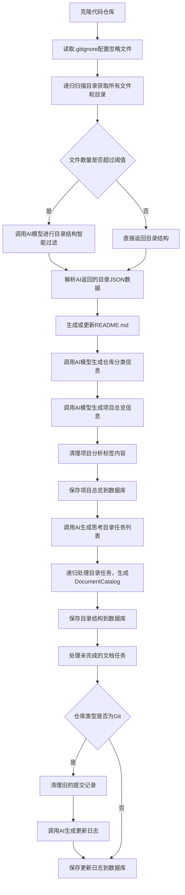

# OpenDeepWiki

[中文](README.zh-CN.md) | [English](README.md)

<div align="center">
  
  <h3>AI驱动的代码知识库</h3>
</div>

---

# 赞助商 Sponsor

[](https://share.302.ai/jXcaTv)

[302.AI](https://share.302.ai/jXcaTv) 是一个按需付费的一站式企业级AI应用平台，提供开放平台和开源生态，助力AI解决各种需求。点击[这里](https://share.302.ai/jXcaTv)获取1美元免费额度！

---

# 功能 Features

- **快速转换**：支持将所有GitHub、GitLab、Gitee、Gitea等代码仓库几分钟内转换为知识库。
- **多语言支持**：支持所有编程语言的代码分析和文档生成。
- **代码结构图**：自动生成Mermaid图，帮助理解代码结构。
- **自定义模型支持**：支持自定义模型和自定义API，灵活扩展。
- **AI智能分析**：基于AI进行代码分析和代码关系理解。
- **SEO友好**：基于Next.js生成SEO友好型文档和知识库，方便搜索引擎抓取。
- **对话式交互**：支持与AI对话，获取代码详细信息和使用方法，深入理解代码。

---

# 特性清单 Feature List

- [x] 支持多代码仓库（GitHub、GitLab、Gitee、Gitea等）
- [x] 支持多编程语言（Python、Java、C#、JavaScript等）
- [x] 支持仓库管理（增删改查仓库）
- [x] 支持多AI提供商（OpenAI、AzureOpenAI、Anthropic等）
- [x] 支持多数据库（SQLite、PostgreSQL、SqlServer等）
- [x] 支持多语言（中文、英文、法文等）
- [x] 支持上传ZIP文件和本地文件
- [x] 提供数据微调平台，生成微调数据集
- [x] 支持目录级仓库管理，动态生成目录和文档
- [x] 支持仓库目录修改管理
- [x] 支持用户管理（增删改查用户）
- [x] 支持用户权限管理
- [x] 支持仓库级别生成不同微调框架数据集

---

# 项目介绍 Project Introduction

OpenDeepWiki是一个开源项目，灵感来源于[DeepWiki](https://deepwiki.com/)，基于.NET 9和Semantic Kernel开发。旨在帮助开发者更好地理解和利用代码库，提供代码分析、文档生成和知识图谱构建等功能。

主要功能：

- 分析代码结构
- 理解仓库核心概念
- 生成代码文档
- 自动生成代码的README.md
- 支持MCP（Model Context Protocol）协议

---

# MCP支持

OpenDeepWiki支持MCP协议：

- 可以作为单仓库的MCPServer，进行仓库分析。

示例配置：

```json
{
  "mcpServers": {
    "OpenDeepWiki":{
      "url": "http://Your OpenDeepWiki service IP:port/sse?owner=AIDotNet&name=OpenDeepWiki"
    }
  }
}
```

- owner：仓库所属组织或拥有者名称
- name：仓库名称

添加仓库后，可通过提问测试，如“什么是OpenDeepWiki？”，效果如下图所示：


这样，OpenDeepWiki可作为MCPServer，供其他AI模型调用，方便分析和理解开源项目。

---

# 🚀 快速开始 Quick Start

1. 克隆仓库

```bash
git clone https://github.com/AIDotNet/OpenDeepWiki.git
cd OpenDeepWiki
```

2. 修改 `docker-compose.yml` 中环境变量配置：

- OpenAI示例：

```yaml
services:
  koalawiki:
    environment:
      - KOALAWIKI_REPOSITORIES=/repositories
      - TASK_MAX_SIZE_PER_USER=5 # AI每用户最大并行文档生成任务数
      - CHAT_MODEL=DeepSeek-V3 # 模型需支持函数调用
      - ANALYSIS_MODEL= # 用于生成仓库目录结构的分析模型
      - CHAT_API_KEY= # 你的API Key
      - LANGUAGE= # 默认生成语言，如“Chinese”
      - ENDPOINT=https://api.token-ai.cn/v1
      - DB_TYPE=sqlite
      - MODEL_PROVIDER=OpenAI # 模型提供商，支持OpenAI、AzureOpenAI、Anthropic
      - DB_CONNECTION_STRING=Data Source=/data/KoalaWiki.db
      - EnableSmartFilter=true # 是否启用智能过滤，影响AI获取仓库文件目录能力
      - UPDATE_INTERVAL # 仓库增量更新间隔，单位天
      - MAX_FILE_LIMIT=100 # 上传文件最大限制，单位MB
      - DEEP_RESEARCH_MODEL= # 深度研究模型，空则使用CHAT_MODEL
      - ENABLE_INCREMENTAL_UPDATE=true # 是否启用增量更新
      - ENABLE_CODED_DEPENDENCY_ANALYSIS=false # 是否启用代码依赖分析，可能影响代码质量
```

- AzureOpenAI和Anthropic配置类似，仅需调整 `ENDPOINT` 和 `MODEL_PROVIDER`。

3. 启动服务

使用Makefile命令：

```bash
# 构建所有Docker镜像
make build

# 后台启动所有服务
make up

# 开发模式启动（可见日志）
make dev
```

访问 http://localhost:8090 进入知识库页面。

Windows用户无make环境，可直接使用Docker Compose：

```bash
docker-compose build
docker-compose up -d
docker-compose up
docker-compose down
docker-compose logs -f
```

---

# 部署建议

- 构建特定架构：

```bash
docker-compose build --build-arg ARCH=arm64
docker-compose build --build-arg ARCH=amd64
```

- 仅构建后端或前端：

```bash
docker-compose build koalawiki
docker-compose build koalawiki-web
```

- 一键部署到Sealos（支持公网访问）：

[](https://bja.sealos.run/?openapp=system-template%3FtemplateName%3DOpenDeepWiki)

详细步骤请参考：[Sealos一键部署OpenDeepWiki](scripts/sealos/README.zh-CN.md)

---

# 🔍 工作原理 How It Works

OpenDeepWiki利用AI实现：

- 克隆代码仓库本地
- 读取.gitignore配置，忽略无关文件
- 递归扫描目录获取所有文件和目录
- 判断文件数量是否超过阈值，超过则调用AI模型智能过滤目录
- 解析AI返回的目录JSON数据
- 生成或更新README.md
- 调用AI模型生成仓库分类信息与项目总览
- 清理项目分析标签内容并保存项目总览到数据库
- 调用AI生成思考目录（任务列表）
- 递归处理目录任务，生成文档目录结构
- 保存目录结构到数据库
- 处理未完成的文档任务
- 若为Git仓库，清理旧提交记录，调用AI生成更新日志并保存

---

# OpenDeepWiki 仓库解析成文档详细流程图



---

# 高级配置 Advanced Configuration

## 环境变量 Environment Variables

- `KOALAWIKI_REPOSITORIES`：仓库存储路径
- `TASK_MAX_SIZE_PER_USER`：AI每用户最大并行文档生成任务数
- `CHAT_MODEL`：聊天模型（需支持函数调用）
- `ENDPOINT`：API端点
- `ANALYSIS_MODEL`：用于生成仓库目录结构的分析模型
- `CHAT_API_KEY`：API密钥
- `LANGUAGE`：生成文档语言
- `DB_TYPE`：数据库类型，默认sqlite
- `MODEL_PROVIDER`：模型提供商，默认OpenAI，支持AzureOpenAI、Anthropic
- `DB_CONNECTION_STRING`：数据库连接字符串
- `EnableSmartFilter`：是否启用智能过滤，影响AI获取仓库目录能力
- `UPDATE_INTERVAL`：仓库增量更新间隔（天）
- `MAX_FILE_LIMIT`：上传文件最大限制（MB）
- `DEEP_RESEARCH_MODEL`：深度研究模型，空则使用CHAT_MODEL
- `ENABLE_INCREMENTAL_UPDATE`：是否启用增量更新
- `ENABLE_CODED_DEPENDENCY_ANALYSIS`：是否启用代码依赖分析，可能影响代码质量

## 构建不同架构 Build for Different Architectures

Makefile命令：

```bash
make build-arm    # ARM架构
make build-amd    # AMD架构
make build-backend-arm   # 仅后端ARM
make build-frontend-amd  # 仅前端AMD
```

---

# 交流社区 Community

- Discord: [join us](https://discord.gg/8sxUNacv)
- 微信公众号二维码：


---

# 📄 许可证 License

本项目采用 MIT 许可证，详情见 [LICENSE](./LICENSE)。

---

# ⭐ Star历史 Star History

[](https://www.star-history.com/#AIDotNet/OpenDeepWiki&Date)
