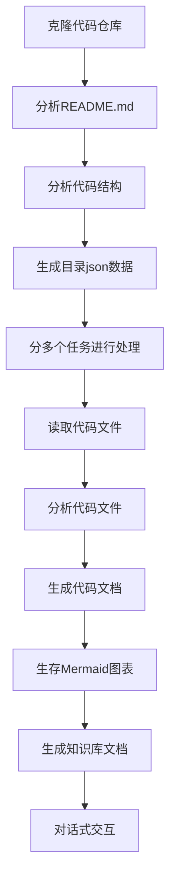

# OpenDeepWiki

<div align="center">
  
  <h3>AI驱动的代码知识库</h3>
</div>


# 项目介绍

OpenDeepWiki 是参考[DeepWiki](https://deepwiki.com/) 作为灵感，基于 .NET 9 和 Semantic Kernel 开发的开源项目。它旨在帮助开发者更好地理解和使用代码库，提供代码分析、文档生成、知识图谱等功能。
- 分析代码结构
- 理解仓库核心概念
- 生成代码文档
- 自动生成代码README.md


## 功能

- **快速生成：** 只需要几分钟即可将所有的Github，Gitlab，Gitee，Gitea等代码仓库转换为知识库
- **多语言支持：** 支持所有编程语言的代码分析和文档生成
- **代码结构：** 自动生存Mermaid图表理解代码结构
- **自定义模型：** 支持自定义模型和自定义API，可以根据需要进行扩展
- **AI智能分析：** 基于AI的代码分析和代码关系的理解
- **轻松SEO:** 生成SEO友好的文档和知识库，使用Next.js构建，让搜索引擎更容易索引
- **对话式交互：** 支持与AI进行对话式交互，获取代码的详细信息和使用方法，深入理解代码

## 🚀 快速开始

1. 克隆代码库
```bash
git clone https://github.com/AIDotNet/OpenDeepWiki.git
cd OpenDeepWiki
```

打开`docker-compose.yml`文件，修改以下配置下面的环境变量：
```yaml
version: '3.8'
services:
  koalawiki:
    image: crpi-j9ha7sxwhatgtvj4.cn-shenzhen.personal.cr.aliyuncs.com/koala-ai/koala-wiki
    environment:
      - KOALAWIKI_REPOSITORIES=/repositories
      - TaskMaxSizePerUser=5 # 每个用户AI处理文档生成的最大并行数量
      - REPAIR_MERMAID=1 # 是否进行Mermaid修复，1修复，其余不修复
      - ChatModel=DeepSeek-V3 # 必须要支持function的模型
      - LANGUAGE= # 设置生成语言默认为“中文”
      - Endpoint=https://api.token-ai.cn/v1
      - AnalysisModel= # 分析模型，用于生成仓库目录结构，这个很重要，模型越强，生成的目录结构越好，为空则使用ChatModel
      - ChatApiKey= #您的APIkey
    volumes:
      - ./repositories:/app/repositories
      - ./data:/data
    build:
      context: .
      dockerfile: src/KoalaWiki/Dockerfile
      
  koalawiki-web:
    image: crpi-j9ha7sxwhatgtvj4.cn-shenzhen.personal.cr.aliyuncs.com/koala-ai/koala-wiki-web
    environment:
      - NEXT_PUBLIC_API_URL=http://localhost:8080
    build:
      context: .
      dockerfile: web/Dockerfile
      
  nginx:
    image: nginx:alpine
    ports:
      - 8090:80
    volumes:
      - ./nginx/nginx.conf:/etc/nginx/conf.d/default.conf
    depends_on:
      - koalawiki
      - koalawiki-web
```

> 💡 **如何获取APIKey:**
> - 获取 Google API key [Google AI Studio](https://makersuite.google.com/app/apikey)
> - 获取 OpenAI API key [OpenAI Platform](https://platform.openai.com/api-keys)
> - 获取 CoresHub [CoresHub](https://console.coreshub.cn/xb3/maas/global-keys) [点击这里免费领取5000万token](https://account.coreshub.cn/signup?invite=ZmpMQlZxYVU=)
> - 获取 TokenAI [TokenAI](https://api.token-ai.cn/)

2. 启动服务

```bash
docker-compose up -d
```
然后访问 http://localhost:8090 即可访问知识库

## 🔍工作原理

OpenDeepWiki使用AI实现：
 - 克隆代码仓库到本地
 - 根据仓库README.md进行分析
 - 分析代码结构，并且根据需要读取代码文件，然后产生需要生成的目录json数据
 - 根据目录分多个任务进行处理，每一个任务都是一个文档
 - 根据任务开始读取代码文件，分析代码文件，生成代码文档，并且生存Mermaid图表表示代码结构依赖关系
 - 生成最终的知识库文档
 - 通过对话式的方式对仓库进行分析，回复用户的问题


## 高级配置

### 环境变量
  - KOALAWIKI_REPOSITORIES # 仓库存放路径
  - TaskMaxSizePerUser # 每个用户AI处理文档生成的最大并行数量
  - REPAIR_MERMAID # 是否进行Mermaid修复，1修复，其余不修复
  - ChatModel # 必须要支持function的模型
  - Endpoint # API的Endpoint
  - AnalysisModel # 分析模型，用于生成仓库目录结构，这个很重要，模型越强，生成的目录结构越好，为空则使用ChatModel
  - ChatApiKey #您的APIkey
  - LANGUAGE # 改变生成的文档的语言

## 📄 License
This project is licensed under the MIT License - see the [LICENSE](./LICENSE) file for details.

## Star History

[](https://www.star-history.com/#AIDotNet/OpenDeepWiki&Date)
