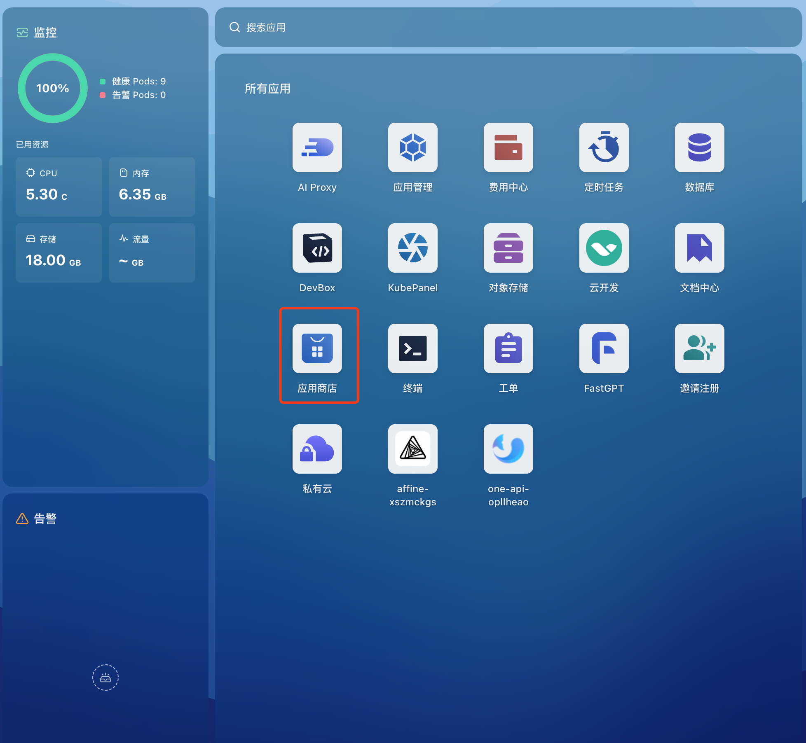
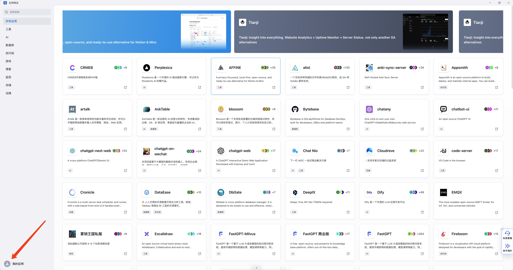
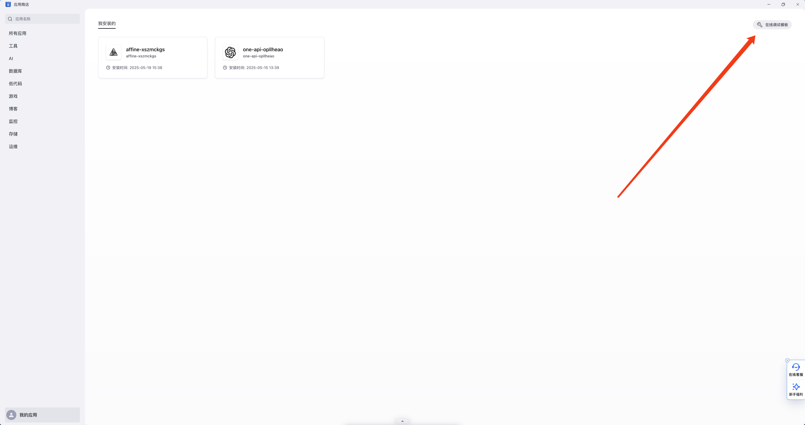
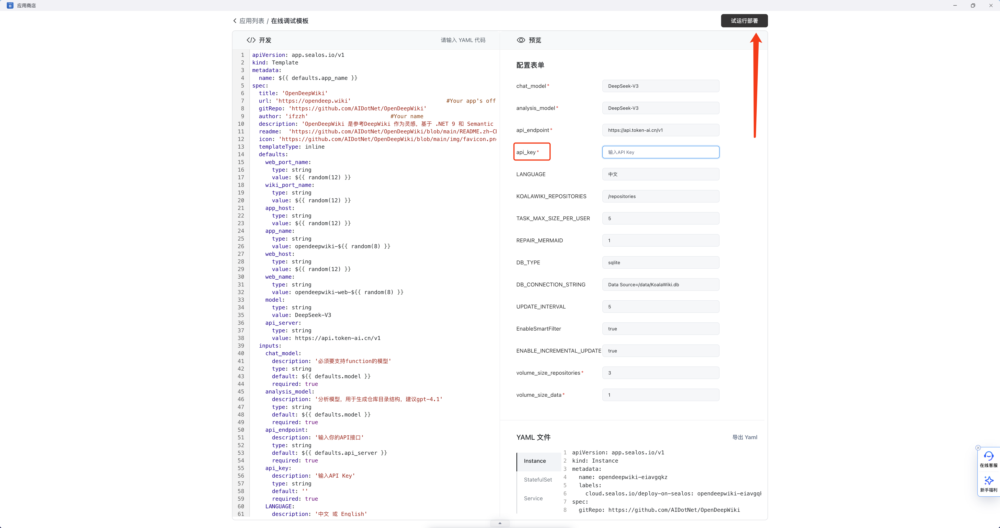
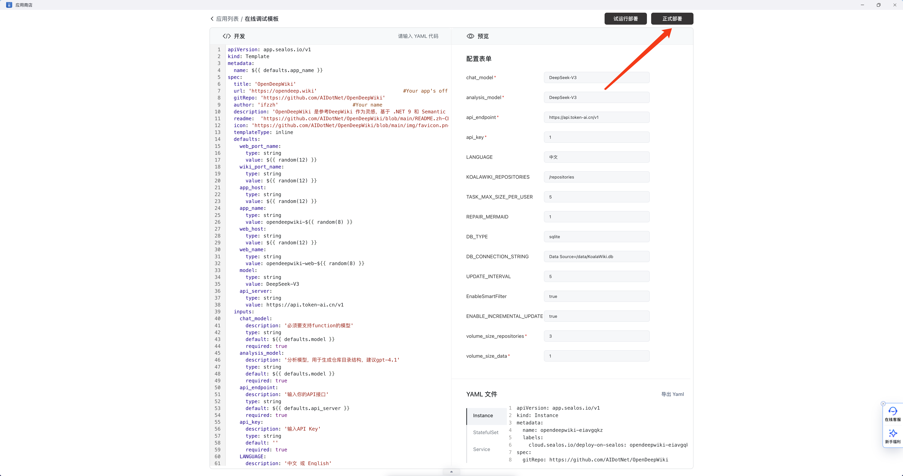
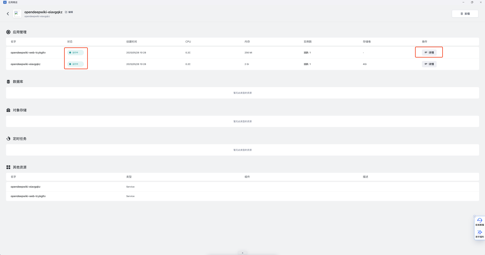
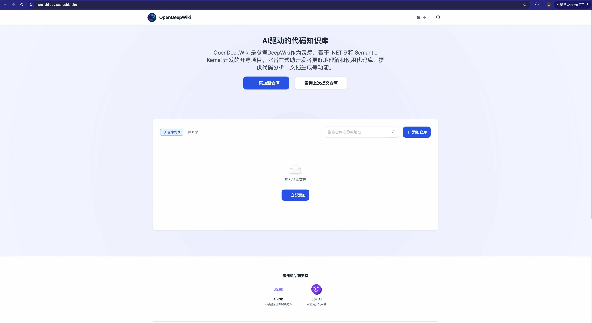

# 使用模板将 OpenDeepWiki 一键部署为 Sealos 应用暴露到公网

### 1. 进入 Sealos 应用商店
打开 Sealos 平台后，在左侧导航栏点击 **「应用商店」**，进入模板市场。  

---

### 2. 打开模板调试模式
点击左下角的 **「我的应用」**，然后在右上角找到 **「在线调试模板」** 按钮。  

---

### 3. 试运行部署
* 将你的模板 [template.yaml](./sealos-template.yaml) 文件内容复制到左侧输入框。  
* 在右侧参数输入区域填写相关配置（如 `api_key`、`analysis_model` 等）。  
* 点击右上角 **「试运行部署」**，检查右侧控制台是否显示 **“部署通过”** 等字样。

---

### 4. 正式部署应用
确认无误后，点击 **「正式部署」**，等待应用状态变为 **“Running”**。  

---

### 5. 查看应用详情
部署成功后，点击应用名称进入应用详情页面，查看应用的外网地址和日志。

---

### 注意事项
- 参数需参考模板要求填写。
- 部署完成后，可通过「应用详情」查看日志和外网地址。