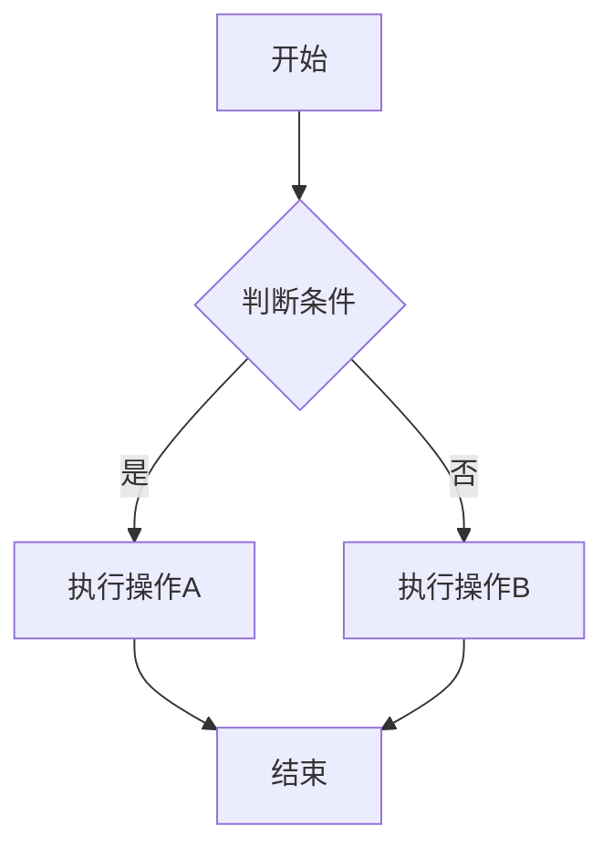
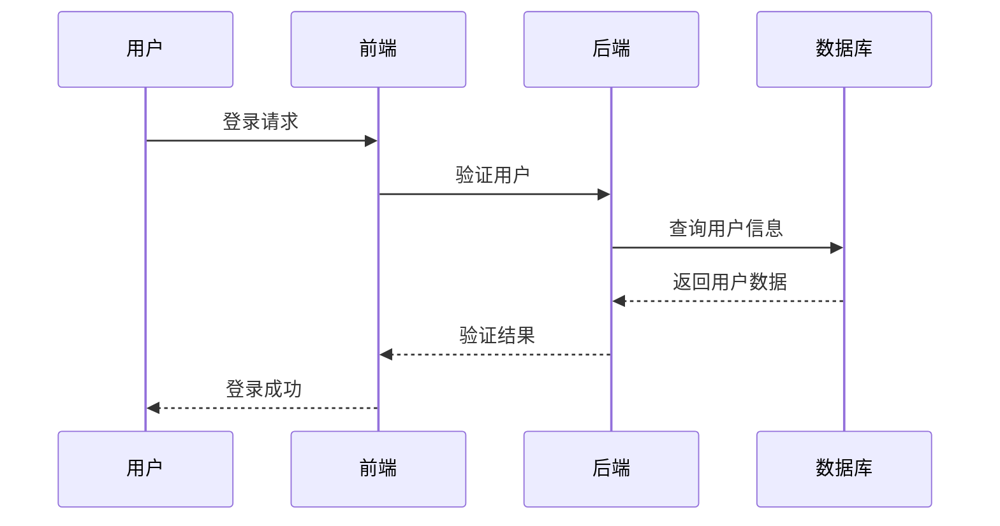
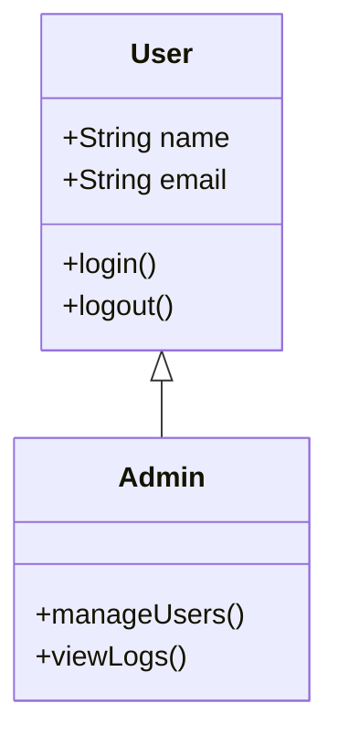
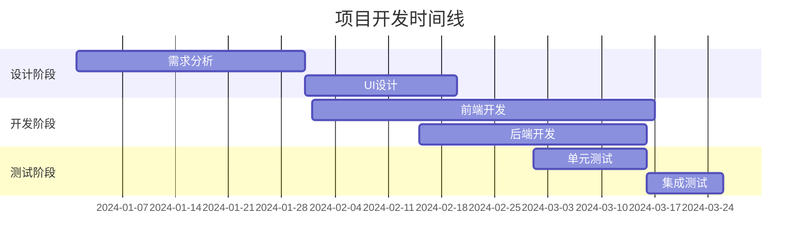
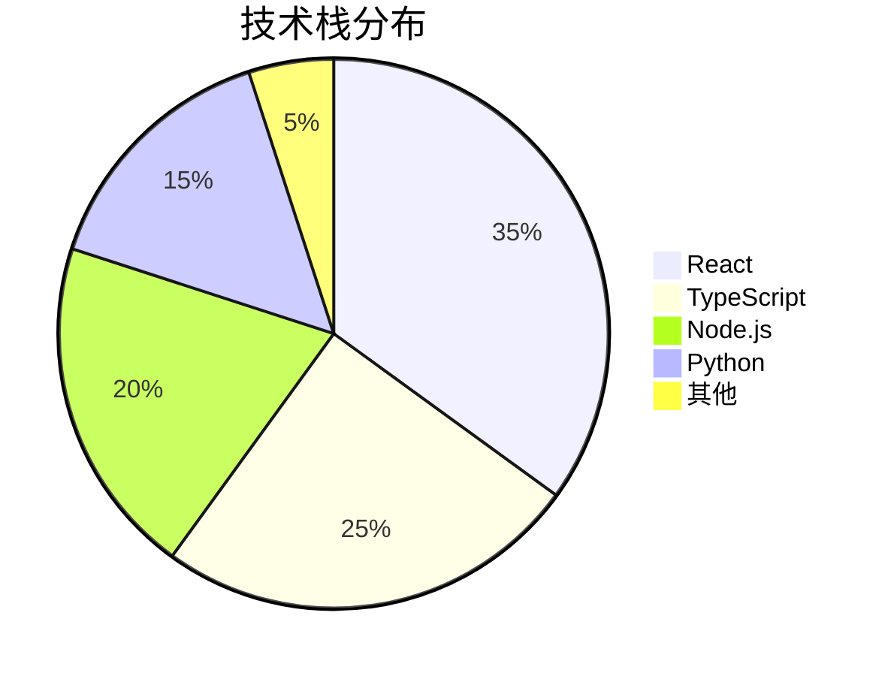

# Mermaid 图表测试

本文档用于测试新优化的 Mermaid 组件样式和功能。

## 流程图示例

```mermaid
graph TD
    A[开始] --> B{判断条件}
    B -->|是| C[执行操作A]
    B -->|否| D[执行操作B]
    C --> E[结束]
    D --> E
```

## 时序图示例

```mermaid
sequenceDiagram
    participant 用户
    participant 前端
    participant 后端
    participant 数据库

    用户->>前端: 登录请求
    前端->>后端: 验证用户
    后端->>数据库: 查询用户信息
    数据库-->>后端: 返回用户数据
    后端-->>前端: 验证结果
    前端-->>用户: 登录成功
```

## 类图示例

```mermaid
classDiagram
    class User {
        +String name
        +String email
        +login()
        +logout()
    }
    class Admin {
        +manageUsers()
        +viewLogs()
    }
    User <|-- Admin
```

## 甘特图示例

```mermaid
gantt
    title 项目开发时间线
    dateFormat  YYYY-MM-DD
    section 设计阶段
    需求分析           :a1, 2024-01-01, 30d
    UI设计            :after a1, 20d
    section 开发阶段
    前端开发          :2024-02-01, 45d
    后端开发          :2024-02-15, 30d
    section 测试阶段
    单元测试          :2024-03-01, 15d
    集成测试          :2024-03-16, 10d
```

## 饼图示例

```mermaid
pie title 技术栈分布
    "React" : 35
    "TypeScript" : 25
    "Node.js" : 20
    "Python" : 15
    "其他" : 5
```